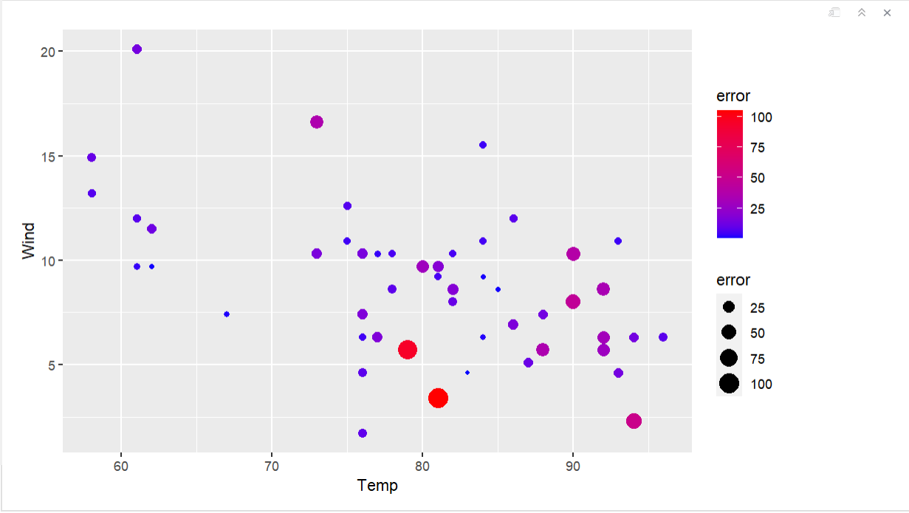
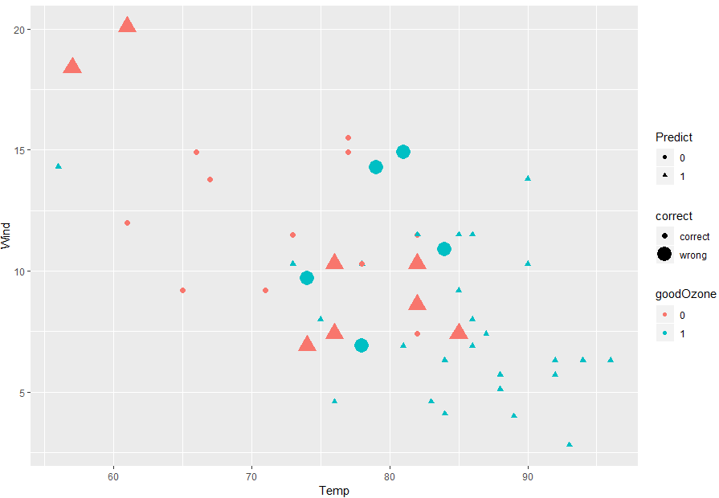

---

# Instructions
Conduct **predictive analytics** on the Air Quality dataset to predict changes in
`ozone` values.You will split the Air Quality dataset into a "**training set**" and
a "**test set**". Use various techniques, such as **Kernel-Based Support Vector Machines** (KSVM), **Support Vector Machines** (SVM), **Linear Modeling** (LM), 
and **Naive Bayes** (NB). Determine which technique is best for the dataset.

Add all of your libraries that you use for this homework here.
```{r setup}
# Add your library below.
install.packages("kernlab")
install.packages("e1071")
library(e1071)
library(kernlab)
library(tidyverse)
```

# Step 1: Load the data 

Let's go back and analyze the air quality dataset (we used that dataset previously 
in the visualization lab). Remember to think about how to deal with the NAs in the data. 
Replace NAs with the median value of the column.

```{r, "Step 1"}
# Write your code below.
data("airquality")
str(airquality)
airquality1 <- airquality %>%
  mutate(across(c(Ozone, Solar.R), 
                ~ ifelse(is.na(.), median(., na.rm = TRUE), .)))
```

---

# Step 2: Create train and test data sets 

Using techniques discussed in class (or in the video), create two datasets – one for training and one for testing. 
--Randomly split the data so that 2/3 of the data is in the training, and 1/3 is in the test data sets (Important: do not use percentage value). Set seed to "11" before sampling. Students should follow this direction "as is" to receive exactly the same value every time. 

```{r, "Step 2"}
#some of the initial codes are given so that students receive exactly the same values in the following steps.
set.seed(11) 
 randIndex <- sample(1:dim(airquality1)[1])
  # In order to split data, create a 2/3 cutpoint and round the number
  cutpoint2_3 <- floor(2*dim(airquality1)[1]/3)
  # check the 2/3 cutpoint
  cutpoint2_3
  # create train data set, which contains the first 2/3 of overall data
  trainData <- airquality1[randIndex[1:cutpoint2_3],]
# Write your code below to create training and test datasets.
  testData <- 
+ airquality1[randIndex[(cutpoint2_3+1):dim(airquality1)[1]],]
```

---

# Step 3: Build a model using "numeric" outcome variable and visualize the results 

## Step 3.1 - Build a model using ksvm
Using `ksvm()`, create a model to try to predict changes in the `ozone` values. 
You can use all the possible attributes, or select the attributes that you think 
would be the most helpful. Of course, use the training dataset and use 10 fold cross validation.

```{r, "Step 3.1"}
# Write your code below.
svmOutput <- ksvm(
  Ozone ~ ., 
  data = airquality1,
  kernel = "rbfdot",
  kpar = "automatic",
  C = 5,
  cross = 10
)
svmOutput

```

## Step 3.2 - Test the model and find the RMSE
Test the model using the test dataset and find the **Root Mean Squared Error** (RMSE).
Root Mean Squared Error formula here:  
* https://www.geeksforgeeks.org/root-mean-square-error-in-r-programming/

```{r, "Step 3.2"}
# Write your code below.
predicted <- predict(svmOutput, testData)
actual <- testData$Ozone
rmse <- sqrt(mean((actual-predicted)^2))
rmse
```

## Step 3.3 - Plot the results. 
Use a scatter plot from ggplot2 package. Have the x-axis represent `Temp`, the y-axis represent `Wind`, 
the point size and color represent the absolute error (absolute value of the actual ozone level minus the predicted ozone level).Use scale_color_gradient to adjust the color gradient, and set low = "yellow", high="red". It should look similar to this:




```{r, "Step 3.3"}
# Write your code below.
testData$error <- abs(actual-predicted)
ggplot(testData, aes(x=Temp, y=Wind)) +
  geom_point(aes(size=error, color=error))+
  scale_color_gradient(low= 'yellow', high = 'red')
  labs(title="Scatter Plot of Air Quality")

```

## Step 3.4 - Compute models and plot the results for `svm()` and `lm()`
Use `svm()` from in the `e1071` package and `lm()` from Base R to computer two 
new predictive models. Generate similar charts for each model.

### Step 3.4.1 - Compute model for `svm()`
```{r, "Step 3.4.1"}
# Write your code below.


```

### Step 3.4.2 - Compute model for `lm()`
```{r, "Step 3.4.2"}
# Write your code below.


```

## Step 3.5 - Print and plot all three model results together
Print out RMSE of KSVM, SVM, and LM first. 
Show the results for the KSVM, SVM, and LM models in one window. Use the `grid.arrange()` function to do this. All three models should be scatterplots. Use scale_color_gradient to adjust the color gradient, and set low = "yellow", high="red". 

```{r, "Step 3.5"}
# Write your code below.
#1. print RMSE of the three models


```

---

# Step 4: Build a model using "categorical" outcome variable and visualize the results--Variable Preparation  

Now, we will build models when the outcome variable is a "factor (categorical) variable." For which, we need to switch Ozone variable from numeric value to a factor value: with a value of either 0 or 1. High ozone is bad for human body. Lets create a new variable named "goodOzone" and set goodOzone == 1 if the ozone is below the average for all the data observations, and 0 if it is equal to or above the average ozone observed.

```{r, "Step 4"}
# Write your code below.


```

---

# Step 5: Build a model using "categorical" outcome variable and visualize the results--Predict "good" and "bad" ozone days. 
Let's see if we can do a better job predicting “good” and “bad” days.

## Step 5.1 - Build a model 
Using `ksvm()`, create a model to try to predict `goodOzone`. 
You can use all the possible attributes, or select the attributes that you think 
would be the most helpful. Of course, use the training dataset.
```{r, "Step 5.1"}
# Write your code below.


```

## Step 5.2 - Test the model and find the percent of `goodOzone`
Test the model on the test dataset, and compute the percent of “goodOzone” that
was correctly predicted.Do not use RMSE. Instead, compute the percentage of correct cases.
```{r, "Step 5.2"}
# Write your code below.
#1. make a prediction and save the outcome as a new object; 2. # create a dataframe that contains the exact "goodOzone" value and the predicted "goodOzone"; 3. # Compute the percentage of correct cases

```

## Step 5.3 - Plot the results 

Use a scatter plot. Have the x-axis represent `Temp`, the y-axis represent 
`Wind`, the shape representing what was predicted (good or bad day), the color 
representing the actual value of `goodOzone` (i.e. if the actual ozone level was
good) and the size represent if the prediction was correct (larger symbols should 
be the observations the model got wrong). 
```
# determine the prediction is "correct" or "wrong" for each case,   

# create a new dataframe contains correct, tempreture and wind, and goodZone

# change column names
  colnames(Plot_ksvm) <- c("correct","Temp","Wind","goodOzone","Predict")
# plot result using ggplot
```
The plot should look similar to this:




 ```{r, "Step 5.3"}
# Write your code below.


```

## Step 5.4 - Compute models and plot the results for `svm()` and `naiveBayes()` 
Use `svm()` from in the e1071 package to compute two new additional predictive models, svm and naiveBayes. Generate similar charts for each model as you've done using ksvm in 5.1-5.3.

### Step 5.4.1 - Compute model for `svm()`
```{r, "Step 5.4.1"}
# Write your code below.


```

### Step 5.4.2 - Compute model for `naiveBayes()`
```{r, "Step 5.4.2"}
# Write your code below.


```

## Step 5.5 - Print percent accuracy of all the three models, and plot all three model results together
Show the results for the KSVM, SVM, and NB models in one window. Use ggplot for graph, using these detailed functions/attribute settings: the `grid.arrange()`function to do this. All three models should be scatterplots. Use scale_color_manual(values=c("#999999", "#E69F00") layer to produce different color graphs than the default color.  

```{r, "Step 5.5"}
# Write your code below.


```


---

# Step 6: Which are the best Models for this data? 

Review what you have done and state which is the best and why.


# Step 7: Upload your compiled file. 
Your compiled file should contain the answers to the questions.